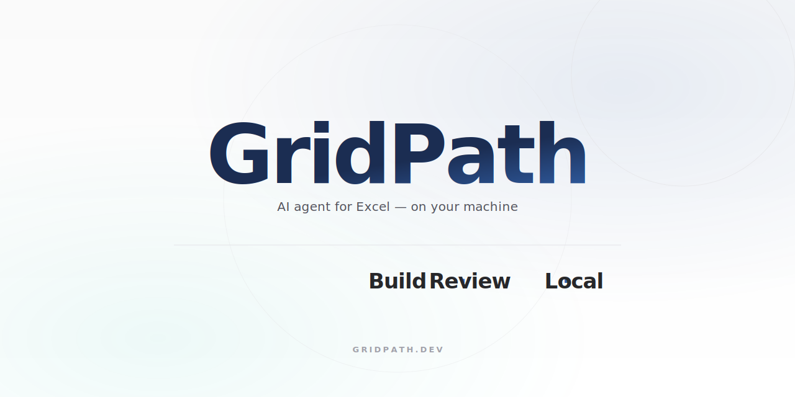

<p align="center">
  
</p>

# GridPath

A source-available desktop AI agent for Excel. You prompt it, it builds and edits real `.xlsx` files — with every change presented as a reviewable diff you can accept or reject before anything touches your workbook.

Works with your existing Claude Pro/Max or ChatGPT Plus/Pro subscription — no API key required.

[**Download for macOS**](https://gridpath.s3.us-east-1.amazonaws.com/GridPath-latest.dmg) · [**Download for Windows**](https://gridpath.s3.us-east-1.amazonaws.com/GridPath_0.0.1_x64_en-US.msi) · [gridpath.dev](https://gridpath.dev) · [FSL-1.1-Apache-2.0](LICENSE)

## What it does

- **Build models from a prompt** — "Build me a 5-year Tesla income statement with SEC actuals through FY25 and FY26–30 projections." The agent fetches the data, lays out the schema, writes formulas in A1 notation, formats the sheet, and stops to let you review.
- **Reviewable diffs before anything sticks** — every edit (set values, set formulas, format, merge, freeze, change column widths) is captured as a pending mutation. One click accepts the batch; reject walks the stack in reverse and restores exact prior values, formulas, number formats, and fills.
- **Real `.xlsx` files** — no upload, no SaaS lock-in. Open the file, edit it, save it, close. The file on disk is a normal `.xlsx` everyone else can open. Charts, conditional formatting, data validation, named ranges, and comments round-trip via ExcelJS so they survive the trip even though the live grid doesn't model them.
- **Parallel sessions per workbook** — open multiple tabs, run different agent sessions on different files concurrently. Each session has its own persisted history, token usage, and accept/reject batches.
- **Bring your own subscription** — Anthropic's `claude setup-token` and OpenAI's Codex CLI both mint OAuth tokens that GridPath replays against `/v1/messages` and `/responses`. No separate API budget required. API keys are supported too.

Data stays on disk in SQLite. Network calls only happen when the agent runs, and they go directly to the provider you chose (Anthropic or OpenAI) — not through any GridPath server.

## How it compares

|                                              | GridPath        | Copilot in Excel |
| -------------------------------------------- | --------------- | ---------------- |
| Local desktop app (data on your machine)     | ✅              | ❌ cloud         |
| Real .xlsx files                             | ✅              | ✅               |
| Reviewable diffs (accept / reject batches)   | ✅              | ❌               |
| Multi-step agent (formulas + format + web)   | ✅              | partial          |
| BYO Claude / ChatGPT subscription            | ✅              | ❌               |
| Source-available                             | ✅ FSL          | ❌               |

## Agent tool surface

The agent has read/write access to a Univer.js-backed grid (real formula engine, real A1 references, real number formats) and can call:

| Tool                       | What it does                                                              |
| -------------------------- | ------------------------------------------------------------------------- |
| `set_cell` / `set_range`   | Write values and formulas in A1 notation                                  |
| `set_format`               | Bulk format ops (bold, currency, percent, colors, alignment, …) in one call|
| `merge_cells` / `freeze_panes` | Layout primitives                                                       |
| `set_column_width` / `set_row_height` | Dimension control                                                   |
| `create_sheet` / `rename_sheet` | Sheet-level ops                                                       |
| `clear_range`              | Clean up before a rebuild                                                  |
| `read_range`               | Let the agent sanity-check its own work before composing dependent formulas|
| `fetch_web`                | Pull source data (SEC filings, financial sites, etc.) directly             |

## Tech stack

| Layer            | Technology                                                                        |
| ---------------- | --------------------------------------------------------------------------------- |
| Desktop shell    | Tauri 2 (Rust)                                                                    |
| Frontend         | React 18 + TypeScript + Vite                                                      |
| Grid             | [Univer.js](https://github.com/dream-num/univer) — full Excel formula engine      |
| File round-trip  | [ExcelJS](https://github.com/exceljs/exceljs) — preserves charts / CF / validation/ named ranges |
| LLM providers    | Anthropic `/v1/messages` (streaming, tools) and OpenAI Codex `/responses`         |
| Database         | SQLite via Diesel                                                                  |
| Updater          | `tauri-plugin-updater` against an S3-hosted release feed                          |

## Build from source

### Requirements

- **Node 20+** (Tauri 2 / Vite 5 baseline)
- **Rust** (stable) — install via [rustup](https://www.rust-lang.org/tools/install)
- Platform toolchains for Tauri — see [Tauri prerequisites](https://v2.tauri.app/start/prerequisites/)

### Run in dev

```bash
npm install
npm run tauri dev
```

### Build a release (local, unsigned)

```bash
npm install
npm run tauri build
```

### Build for macOS distribution (signed + notarized + uploaded to S3)

```bash
./scripts/build-mac.sh                # build + sign + notarize + upload
./scripts/build-mac.sh --no-upload    # local signed build only
```

Credentials auto-load from `.env.build` (gitignored). See the script header for the required env vars (`APPLE_API_*`, `APPLE_SIGNING_IDENTITY`, `TAURI_SIGNING_PRIVATE_KEY`, etc.).

### Configure

On first launch you'll be asked which provider to use:

1. **Claude subscription** — paste an OAuth token from `claude setup-token`, OR
2. **Claude API key** — paste an `sk-ant-api03-*` key, OR
3. **ChatGPT subscription** — sign in via the Codex OAuth flow (browser tab opens automatically).

Credentials are stored locally in the SQLite app database — they don't leave your machine.

## Architecture notes

A few of the less-obvious decisions:

- **Subscription OAuth via the official CLIs.** Both `claude setup-token` and OpenAI's Codex CLI mint OAuth tokens that GridPath replays directly. Anthropic requires the first system block to be the literal string `"You are Claude Code, Anthropic's official CLI for Claude."` or it 401s. OpenAI's Codex backend accepts `gpt-5.5` for ChatGPT subscriptions but 400s on `gpt-5-codex`.
- **Reversible edits without "save a copy of the original."** Every agent tool call captures a pre-state snapshot of the cells it touches; reject walks the stack in reverse. Univer's facade is fast enough to apply edits live so the user previews the result while it's still in "pending review."
- **Excel round-trip preserves what Univer doesn't model.** Univer is great for editing and formulas but doesn't model charts, conditional formatting, validation, or comments. ExcelJS stays loaded in parallel: edits go through Univer; on save, the changed cells merge back into the ExcelJS workbook so charts/CF/named-ranges survive the round-trip.
- **Prompt-cache breakpoints.** System prompt + tool schema are pinned with Anthropic's `cache_control: ephemeral` so subsequent turns serve the entire prefix from cache. Tool-result readbacks are bounded (200 cells per `set_range`, error-cells-only is a roadmap item) so prefix growth across turns stays linear.

## Project status

Active development. The agent's core loop is solid for income-statement-class models; complex multi-sheet builds (full 3-statement models, sensitivity tables across sheets) still occasionally trip on layout-tracking and are an active area of work.

Useful entry points if you're reading the source for the first time:

- [`src/screens/SpreadsheetScreen/SpreadsheetScreen.tsx`](src/screens/SpreadsheetScreen/SpreadsheetScreen.tsx) — main product UI, event handlers, accept/reject
- [`src/screens/SpreadsheetScreen/components/UniverGrid.tsx`](src/screens/SpreadsheetScreen/components/UniverGrid.tsx) — grid + ExcelJS round-trip
- [`src-tauri/src/engine/spreadsheet_agent/commands.rs`](src-tauri/src/engine/spreadsheet_agent/commands.rs) — agent loop, provider dispatch, tool result handling
- [`src-tauri/src/engine/spreadsheet_agent/tools.rs`](src-tauri/src/engine/spreadsheet_agent/tools.rs) — tool schemas + the system prompt that drives behavior
- [`src-tauri/src/engine/llm_providers/`](src-tauri/src/engine/llm_providers/) — Claude + Codex provider implementations

## Contributing

See [CONTRIBUTING.md](CONTRIBUTING.md).

## Acknowledgments

GridPath stands on the shoulders of:

- [Univer.js](https://github.com/dream-num/univer) — the spreadsheet kernel + formula engine
- [ExcelJS](https://github.com/exceljs/exceljs) — `.xlsx` parsing / writing with chart and conditional-formatting fidelity
- [Tauri](https://v2.tauri.app/) — the desktop shell
- The Anthropic and OpenAI engineering teams for the official CLIs that make the subscription-OAuth path practical

## License

GridPath is source-available under the [Functional Source License, Version 1.1, with Apache 2.0 Future License](LICENSE) (FSL-1.1-Apache-2.0). In short:

- **You can** read, fork, modify, run, and redistribute the source for any non-competing use — including your own commercial use of the software.
- **You can't** ship the software (or a substantially similar fork) as a paid product or service that competes with GridPath.
- **In two years**, each release automatically re-licenses to Apache 2.0 — no restrictions.
