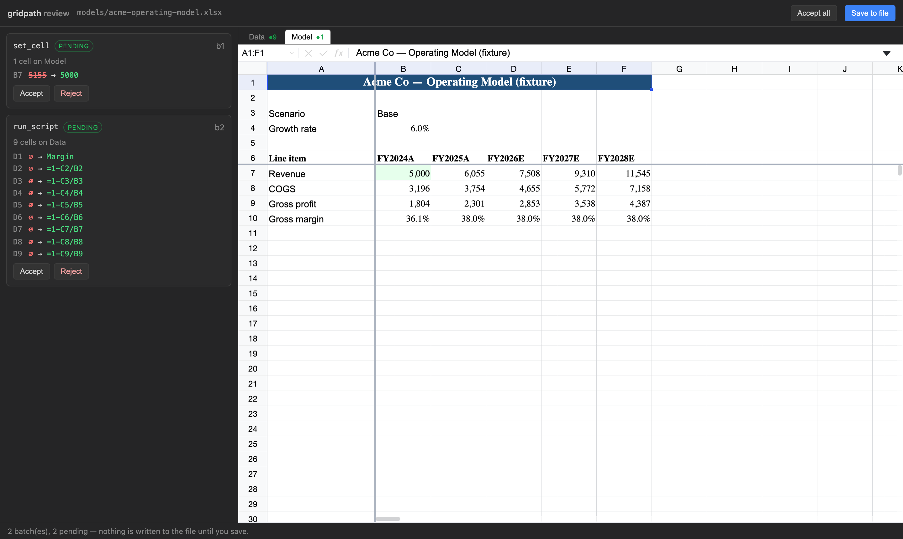

<p align="center">
  
</p>

# GridPath

**Let AI edit the Excel files you already have: faster, for fewer tokens, and you get them back intact.**

GridPath is an engine for editing real `.xlsx` files. Give it to your coding
agent and the same edit takes a fraction of the time and tokens, because the
agent calls spreadsheet tools instead of writing and debugging scripts:

- **Faster and cheaper.** An in-process calculation engine and purpose-built
  tools (workbook map, row search, structural edits) replace the write-a-script,
  run-it, recalculate-somewhere-else loop.
- **Intact.** A surgical saver rewrites only the parts an edit touched; charts,
  pivots, VBA, add-in data and everything else come back byte-identical.
- **Reviewed.** You see every changed cell, before and after, and nothing is
  written until you accept.

Claude Code (Sonnet 5.5) on a real 1.4 MB, 55,000-formula analyst model, same
prompt with and without GridPath:

| Task | With GridPath | Without |
|---|---|---|
| Insert a row (median of 5 runs) | **17 s** · 1.0k output tokens · $0.35 | 52 s · 6.1k · $0.86 |
| Change 12 inputs and report the recalculated result (1 run) | **29 s** · 2.2k output tokens · $0.49 | 161 s · 17.1k · $1.62 |

Both lanes got every edit right. The difference is time, tokens, and seeing the
diff before it's saved. Full runs, including the ones we lose, are in the
[evals repo](https://github.com/pixelsmasher13/gridpath-evals).

It comes as two front doors on the same engine:

| | **MCP server** — `npx gridpath mcp` | **Desktop app** |
|---|---|---|
| The agent | Yours: Claude Code, Cursor, Codex, any MCP host | GridPath's own, in the app |
| You review | In a local browser tab the agent links you to | In the app's diff panel |
| Install | One line, Node only | Download for Mac / Windows |
| Where | [`packages/gridpath`](packages/gridpath) · [gridpath.dev/mcp](https://gridpath.dev/mcp) | [Releases](https://github.com/pixelsmasher13/gridpath/releases/latest) · [gridpath.dev](https://gridpath.dev) |

Source-available under the [FSL-1.1-Apache-2.0](LICENSE); each release becomes Apache 2.0 after two years.

## MCP server

```sh
claude mcp add gridpath -- npx -y gridpath mcp --review-required
```

Your agent edits the real `.xlsx` through GridPath's tools (describe, find,
read, write, `run_script`, structure ops). Every change returns a readback and a
**review link**: changed cells before/after, accept or reject per batch, save.
Nothing is written until you save; with `--review-required` only the review page
can save. No Python, no LibreOffice, no Excel needed. Details, host config
snippets and the tool list: [packages/gridpath/README.md](packages/gridpath/README.md).

[](https://gridpath.dev/mcp)

## Desktop app

Open a `.xlsx`, type what you want, review the diff, accept it. Multiple
workbooks side by side, each with its own agent; other files attachable as
read-only references. Your file never leaves your machine, and it works with
the Claude or ChatGPT subscription you already pay for.

**[Download GridPath](https://github.com/pixelsmasher13/gridpath/releases/latest)**

### What the app does

- **Multi-workbook** — Workbooks side by side, each with its own agent. Attach others as read-only references.
- **Reversible changes** — Diff-first edits. Accept, reject or use ⌘Z. Nothing saves until you say so.
- **Spreadsheet-native harness** — With the same model, GridPath ran 3.9–14× faster in our [benchmarks](https://github.com/pixelsmasher13/gridpath-evals) and used 95–96% fewer output tokens on edit tasks.
- **Workbook fidelity** — Surgical saves rewrite only what changed; charts, pivots, formatting, VBA and plugin data stay intact.
- **Formula-first** — Writes formulas, not pasted numbers, so models stay live.
- **Local-first** — Your `.xlsx` stays on disk. Only your prompt and the cells the agent needs go to Claude or OpenAI.

## How it compares

| | GridPath | Excel Copilot | Claude for Excel | ChatGPT upload | CLI coding agent |
|---|---|---|---|---|---|
| Edits your existing `.xlsx` in place | ✅ | ✅ | ✅ | ❌ | ✅ |
| Workbook stays on your machine | ✅ | ❌ | ❌ | ❌ | ✅ |
| Preserves charts, pivots, plugin data | ✅ | ✅ | ✅ | ❌ | ❌ |
| Accept/reject diff before changes land | ✅ | partial | partial | ❌ | ❌ |
| Choose and switch the model | ✅ | ❌ | ❌ | ❌ | ✅ |
| Parallel sessions across workbooks | ✅ | ❌ | ❌ | ❌ | partial |
| Source available | ✅ | ❌ | ❌ | ❌ | ❌ |
| Included with a subscription you have | ✅ | ❌ | ✅ | ✅ | ✅ |

*Best-effort comparison as of September 2026. The "preserves" and "diff" rows for coding agents are measured, not inferred — see the [benchmark repo](https://github.com/pixelsmasher13/gridpath-evals). On the August 2026 models a headless coding agent silently dropped parts of a workbook in 2 of 5 edit runs; on Sonnet 5.5 (September 2026) it preserved every part in all of our runs by choosing XML surgery on its own. GridPath preserves them by construction, not by the model's judgment on the day.*

## Project status

Under active development. Editing existing workbooks — the case above — is the strongest path and the one under continuous benchmark. Building large multi-sheet models from scratch works but is improving; the [benchmark repo](https://github.com/pixelsmasher13/gridpath-evals) publishes those results too, including the ones we lose.

## Source availability and license

Source-available under the [Functional Source License, Version 1.1, with Apache 2.0 Future License](LICENSE) (FSL-1.1-Apache-2.0):

- **You can** read, fork, modify, run and redistribute the source for any non-competing use, including commercially.
- **You can't** ship it, or a substantially similar fork, as a paid product competing with GridPath.
- **In two years** every release re-licenses to Apache 2.0, no restrictions.

If you want to use GridPath in a way the FSL doesn't permit, get in touch.

## Build from source

Requires **Node 20+**, **Rust** stable via [rustup](https://www.rust-lang.org/tools/install), and your platform's [Tauri prerequisites](https://v2.tauri.app/start/prerequisites/).

```bash
npm install
npm run tauri dev
```

`npm run tauri build` produces a local unsigned build. On first launch, connect Claude with OAuth or an API key, or use the ChatGPT sign-in flow. Credentials stay in the local SQLite database.

### Architecture

GridPath uses Tauri 2 with a Rust core, React and TypeScript, a vendored [IronCalc](vendor/ironcalc) fork (MIT/Apache-2.0), and SQLite. The surgical `.xlsx` patcher is in `src-tauri/src/engine/workbook/xlsx_patch/`, the agent loop in `src-tauri/src/engine/spreadsheet_agent/`, and the benchmark harness in `eval/`.
